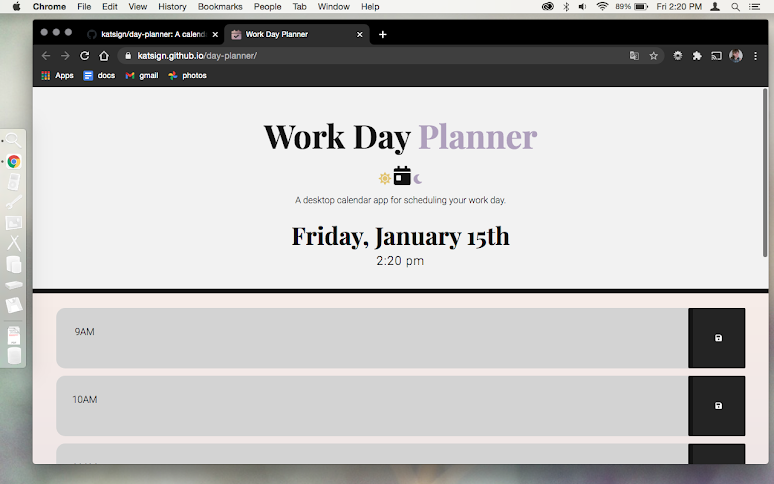
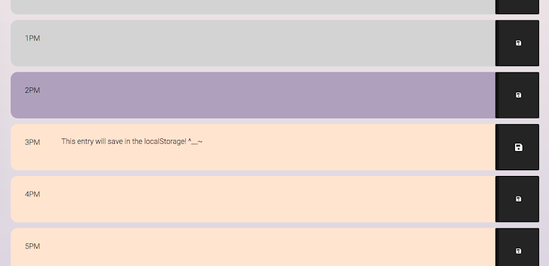
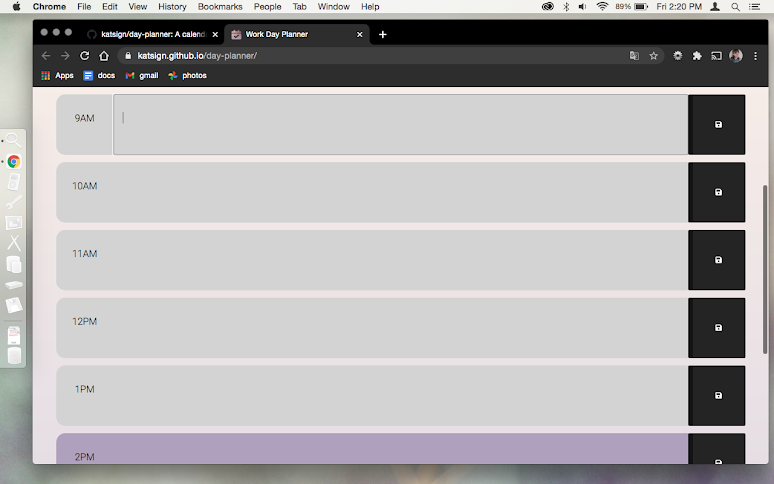
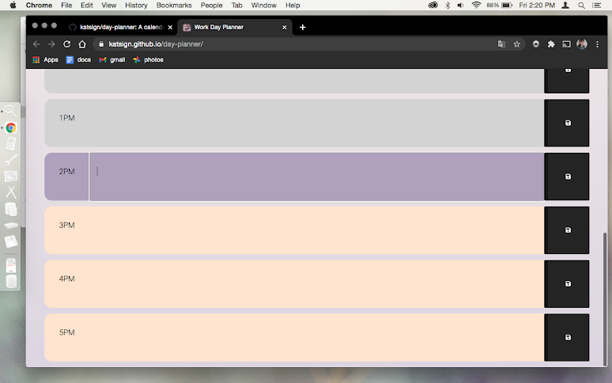

# No-Stress Work Day Planner :calendar:
### Save and clear events in soothing pastel timeblocks to keep track of your daily tasks while working from home.

## Description
### Link to deployment: https://katsign.github.io/day-planner/

This simple browser application uses jQuery to access the [Moment.js](https://momentjs.com/) library and manipulate the timeblocks of a virtual day planner. When the user looks at the app during work day hours (9 AM to 5 PM in this case) the timeblocks in the past appear grey; the present, purple; and the future, tan. When an entry is made into a timeblock's textarea, an event listener runs a function to save that data to the local storage of the user's machine. The past saved entries will appear on window load unless replaced/cleared and re-saved.

When accessed from too small a screen, a media query in the stylesheet hides the main content and displays an error message.

## Demo

### At the top of the screen, a jumbotron displays the current day and the time.

### The screenshots below show the timeblocks colored based on the time 2:20pm. The program loops through the timeblocks and changes the class with jQuery, manipulating the colors to correspond to the time of day.

Timeblocks 9AM-2PM            |  Timeblocks 2-5PM
:-------------------------:|:-------------------------:
  |  

## Credits

### :milky_way: [Bootstrap 4.0](https://getbootstrap.com)
### :cyclone: [Font Awesome Icons](https://fontawesome.com/icons?d=gallery)
### :blue_book: [Google Fonts](https://code.jquery.com/)
### :globe_with_meridians: [jQuery CDN](https://fonts.google.com/)
